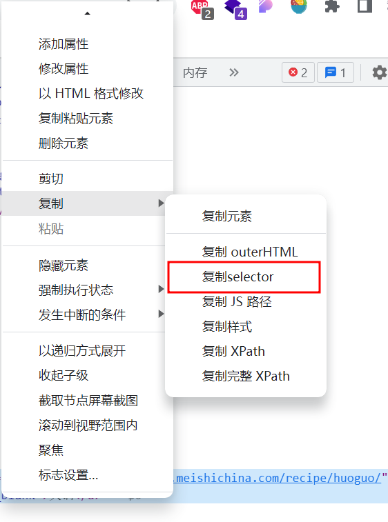
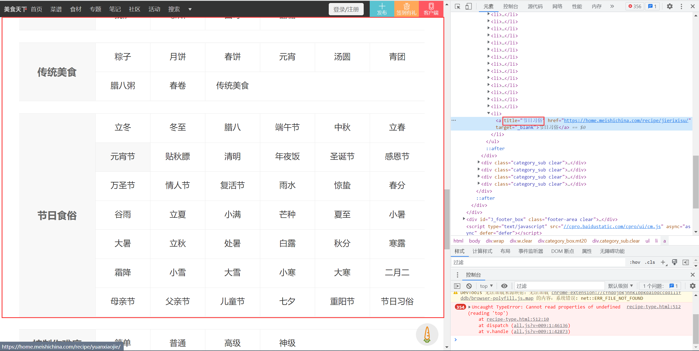
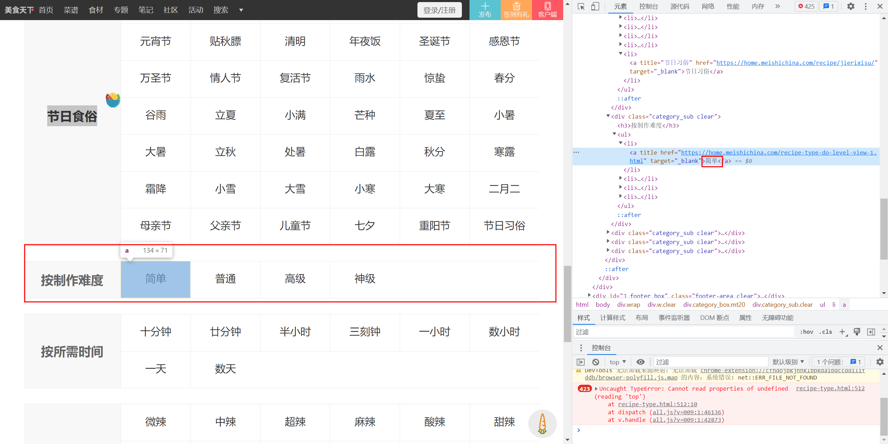

# 便捷获取元素指定selection
元素右键 -> 复制 -> 复制selector


# 爬取页面
## 菜谱分类
### 分类HTML格式
#### 格式1:
节日食俗大类以及节日食俗以前的大类下的元素都是将分类名称嵌套到title属性中，如下图所示。

#### 格式2：
节日食俗大类以后的分类都会将分类名称嵌套到元素内容中，如下图所示

### 程序代码

```go
	document.Find("body > div.wrap > div > div > div > ul > li").Each(func(i int, selection *goquery.Selection) {
		categoryName, categoryNameExists := selection.Find("a").Attr("title")

		categoryURL, categoryURLExists := selection.Find("a").Attr("href")
		if categoryNameExists {
			categoryName = selection.Find("a").Text()
			if categoryName == "" {
				log.Warn().
					Msg("超链接名称元素不存在")
			}
		}

		if categoryURLExists {
			log.Warn().
				Msg("超链接URL元素不存在")
		}

		fmt.Println(categoryName)
		fmt.Println(categoryURL)
	})
```


# 遇到的问题
## 程序阻塞问题
因为channel中缓存的数据还没有被任意协程获取到，导致程序即便程序运行完毕也会一直阻塞。