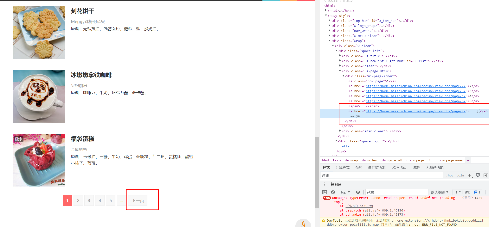
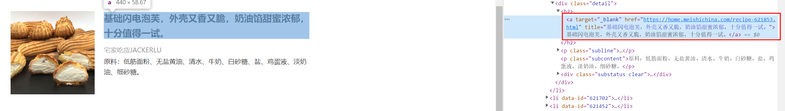
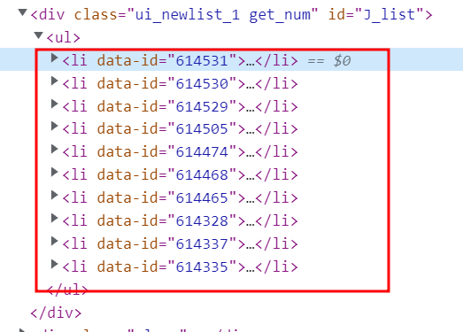
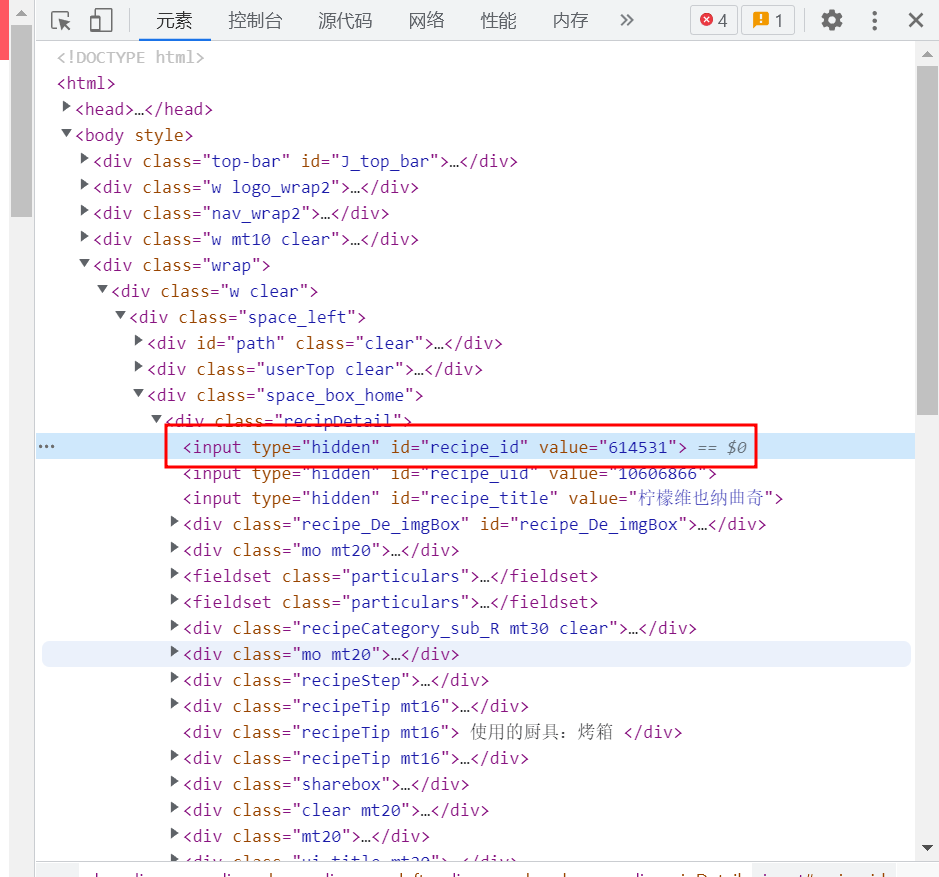
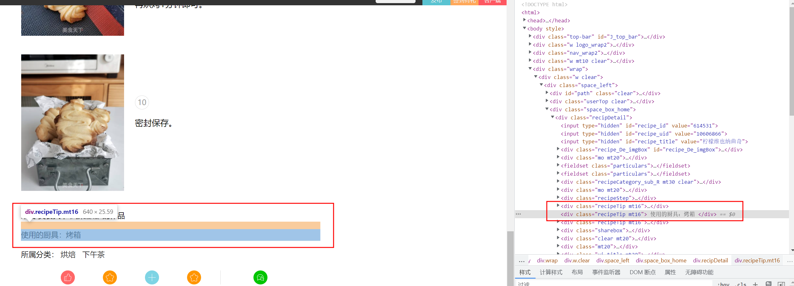

# 便捷获取元素指定selection
元素右键 -> 复制 -> 复制selector


# 爬取页面
## 菜谱分类
### 分类HTML格式
#### 格式1:
节日食俗大类以及节日食俗以前的大类下的元素都是将分类名称嵌套到title属性中，如下图所示。

#### 格式2：
节日食俗大类以后的分类都会将分类名称嵌套到元素内容中，如下图所示

### 程序代码

```go
	document.Find("body > div.wrap > div > div > div > ul > li").Each(func(i int, selection *goquery.Selection) {
		categoryName, categoryNameExists := selection.Find("a").Attr("title")

		categoryURL, categoryURLExists := selection.Find("a").Attr("href")
		if categoryNameExists {
			categoryName = selection.Find("a").Text()
			if categoryName == "" {
				log.Warn().
					Msg("超链接名称元素不存在")
			}
		}

		if categoryURLExists {
			log.Warn().
				Msg("超链接URL元素不存在")
		}

		fmt.Println(categoryName)
		fmt.Println(categoryURL)
	})
```
## 遍历分类页
只要找到包含下一页文本的元素的href即可
如果找到不到则是到了分类末页了，跳出递归调用即可

代码如下
```go

func recursiveGetPage(url string, client *resty.Client, wg *sync.WaitGroup, channel chan string, detailChannel chan []byte) {
	response, err := client.R().Get(url)

	log.Info().Msg("开始执行recursiveGetPage")

	functionStart := time.Now().Unix()

	if err != nil {
		log.Err(err)
	}

	reader := bytes.NewReader(response.Body())
	fromReader, err := goquery.NewDocumentFromReader(reader)

	if err != nil {
		log.Err(err)
	}
	nextPageUrl, exists := fromReader.
		Find("a:contains(下一页)").
		Attr("href")

	log.Debug().Str("nextPage", nextPageUrl).Msg("")

	if exists {

		if err != nil {
			log.Err(err)
		}

		wg.Add(1)
		go parsingPageFood(client, wg, url, detailChannel)

		functionEnd := time.Now().Unix()
		log.Info().Int64("recursiveGetPage执行时间", functionEnd-functionStart).Msg("")

		recursiveGetPage(nextPageUrl, client, wg, channel, detailChannel)
	}
}
```
## 详情页
右键copy selector就可以拿到selector，然后循环遍历即可拿到本页的所有详情页。

代码如下所属
```go
		// 详情页
		foodDetailUrl, foodDetailUrlExists := selection.Find("li div.detail > h2 > a").Attr("href")
		if foodDetailUrlExists {
			foodDetailResponse, foodDetailError := client.R().Get(foodDetailUrl)
			if foodDetailError != nil {
				log.Err(foodDetailError)
			}

			if foodDetailResponse.StatusCode() != 200 {
				time.Sleep(time.Second)
				log.Warn().Int("code", foodDetailResponse.StatusCode()).Str("url", foodDetailUrl).Msg("状态码异常")
			} else {
				log.Debug().Str("url", url).Msg("parsingPageFood(client *resty.Client, wg *sync.WaitGroup, channel chan []byte, detailChannel chan []byte)")

				detailChannel <- foodDetailResponse.Body()
			}

		}
	})
```

可以获取li元素的data-id属性拿到数据id即便不用这种方式，详情页也有元素可以拿到data-id
如下图所示

之后详情页除了厨具和分类的元素位置都不尽相同以外，其他元素都是老套路 copy selector直接获取text或是遍历整个元素提取想要的内容。
而厨具和分类元素的解决方案放在遇到问题中了

# 遇到的问题
## 程序阻塞问题
+ 如果channel没有接收者会阻塞。
+ 如果channel接收完发送的数据会阻塞。
## 429错误
添加resty重试条件，如果http状态码不等于200则换代理并重试
## 每个美食的元素位置都不尽相同，无法直接复制selector

左侧元素没办法直接Copy selector，需要将整个文本遍历出来，之后根据文本内容行数进行分割，并按规律赋值到结构体即可。

如果是以`使用的厨具：`
# 递归调用使协程和channel阻塞
去掉递归的go关键字
